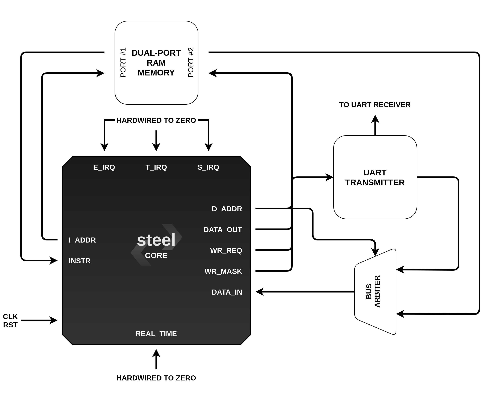

# Getting Started

## What you need to know first

Steel must be connected to a word-addressed memory with read/write latency of 1 clock cycle. Block RAM IPs (e. g. *Xilinx Block Memory Generator* or *Intel RAM Megafunction*) can be easily configured to meet these requirements. The interfaces to fetch instructions and to read/write data were designed to facilitate the integration with FPGA Block RAMs.

If you do not need hardware timers, you must connect the `REAL_TIME` bus to a hardwired value. Otherwise, you must connect it to a real-time counter. The `E_IRQ`, `T_IRQ`, and `S_IRQ` signals (used to request for interrupts) can be connected to a single device or to an interrupt controller that manages interrupts from multiple devices. If interrupts are not needed, these signals must be connected to zero.

## Using Steel in your project

To use Steel in your project you must import all files from the `rtl` directory to it. Then instantiate Steel using the following template:

```verilog
steel_top core(
    .CLK(  ),
    .RESET(  ),
    .REAL_TIME(  ), 
    .I_ADDR(  ),
    .INSTR(  ),
    .D_ADDR(  ),
    .DATA_OUT(  ),
    .WR_REQ(  ),
    .WR_MASK(  ),
    .DATA_IN(  ),
    .E_IRQ(  ),
    .T_IRQ(  ),
    .S_IRQ(  )
);
```

Read the section [Input and Output Signals](steelio.md) for more information on the input/output signals above.

## Writing software for Steel

You can write, compile and assemble C/C++ software for Steel with [RISC-V GNU Toolchain](https://github.com/riscv/riscv-gnu-toolchain). Follow the instructions in the [README.md](https://github.com/riscv/riscv-gnu-toolchain/blob/master/README.md) file for installing the Newlib cross-compiler. **Don't forget** to add the options `--with-arch=rv32i` and `--with-abi=ilp32` when configuring the installation:

```
./configure --prefix=/opt/riscv --with-arch=rv32i --with-abi=ilp32
make
```

To run the software you wrote you must initialize the memory with it. If you use a Block RAM IP as memory, you can initialize it by converting the ELF file generated by the compiler to a memory initialization file (HEX, MIF, COE, or other formats, depending on the FPGA you use).

## Example system

The figure below shows an example of how Steel can be used as processing unit in embedded systems projects. The same architecture can be used to build other systems. The example is composed of a dual-port Block RAM, a memory mapped GPIO unit, a bus arbiter, an interrupt controller and a real-time counter. In this system, the address space is divided into two ranges, one assigned to memory and the other to the GPIO unit. The bus arbiter is used to multiplex the data interface signals according to the address the core wants to access.


