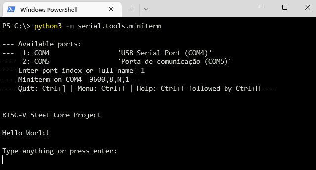

---
hide:
  - navigation
---

# Getting started

## Overview

This guide shows you how to get the [Hello World project](https://github.com/rafaelcalcada/steel-core/tree/main/hello_world/vivado) working on the [Arty A7-35T](https://digilent.com/shop/arty-a7-artix-7-fpga-development-board/) development board. The project instantiates Steel as a softcore on Arty along with a UART unit, which allows communication between the board and your computer. A program that sends a Hello World message is run on Steel and you can interact with the board through a serial terminal.

The Hello World project is a great starting point for your own projects. It has a working instance of Steel so you can easily adapt it to control other devices by making simple changes to it.

## 1. Install prerequisites

Before you start make sure you have the following software installed on your machine:

**Xilinx Vivado**

At the heart of the [Arty A7-35T](https://digilent.com/shop/arty-a7-artix-7-fpga-development-board/) board is a Xilinx Artix-7 FPGA. You need Vivado installed on your machine to be able to program the board.

The latest version of Vivado is available for [download here](https://www.xilinx.com/support/download.html). During installation, remember to include support for the Artix-7 device family and the cable drivers.

**pySerial**

[pySerial](https://pyserial.readthedocs.io/en/latest/index.html) is a Python package that allows your computer to communicate over UART serial protocol. After the installation, your computer will be able to send and receive messages to and from the board.

To install pySerial open a terminal and run:

```
$ python -m pip install pyserial
```

## 2. Download Steel Core

Run the following command to clone the Steel Core repository from GitHub:

```
$ git clone https://github.com/rafaelcalcada/steel-core.git
```

## 3. Start a serial terminal

Before starting the a terminal, connect Arty to your computer using the USB cable. Make sure the board is powered on (a red LED should be lit).

Then run the following command to start a new serial terminal:

```
$ python -m serial.tools.miniterm
```

A list of available serial ports will show up on the screen. Select the port the board is connected to and **keep the terminal open** for the next steps.

!!! tip
    If your computer shows more than one available serial port and you're not sure which one is your board's you can find it out by running the command above with the board disconnected and then running it again with the board connected. The "extra" port in the list when the board is connected is the port you're looking for.

## 4. Program the FPGA

Open Vivado and follow the steps below to get the Hello World project running on [Arty](https://digilent.com/shop/arty-a7-artix-7-fpga-development-board/):

- Open the `hello_world.xpr` file located in the `hello_world/vivado/` folder on Vivado.

- Click on *Open Hardware Manager*, located in the section *Program and Debug* of the *Flow Navigator* (the navigation bar on the left).

- Next, click on *Open Target > Auto Connect*.

- Vivado will autodetect Arty's FPGA. The device `xc7a35t_0` should appear in the Hardware box. Right-click on `xc7a35t_0` and choose *Program Device*.

- The bitstream file `hello_world.bit` (located at `hello_world.runs/impl_1/`) should appear in the file input box. To finish programming the FPGA, click on the *Program* button.

Arty's FPGA is now programmed with the Hello World project!

## 5. Interact with the Hello World system

The board sends the following message immediately after the FPGA is programmed:



When you type a character it is echoed back on the screen. When you press Enter, the message "You pressed Enter key" is shown.

Although simple, the UART connection between the board and your computer allows you to:

- Send commands to control devices on Arty from your computer
- Obtain and display information about the status of devices on or connected to the board

</br>

